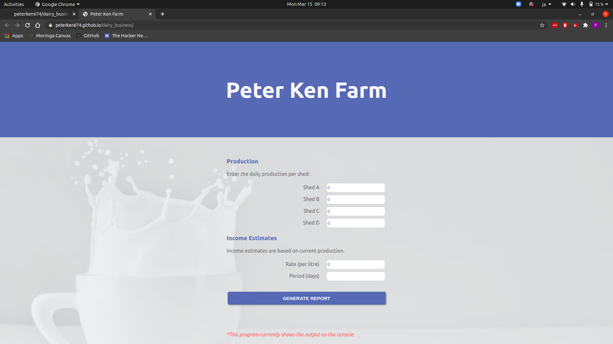
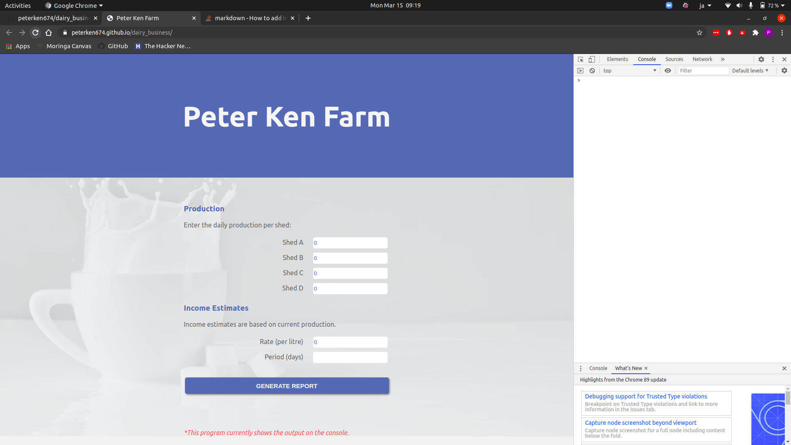

# Peter Ken Farm
#### Peter Ken Dairy farm website, 2021.
#### By **Peter Kennedy**
## Description
Peter Ken Dairy farm website for tracking milk production and sale to Brookside. The site also provides estimate on how much one would earn on each month in a leap year using the given rates and daily production per shed.

## Setup/Installation
To view the website, go to [peterken674.github.io/anitas-kitchen](https://peterken674.github.io/dairy_business). 
1. Open your web browser, preferrably Google Chrome.
2. Open the browser console using Ctrl + Shift + I.

3. Fill the fields indicated on the site respectively.
4. When done filling all the fields, click on generate report button and observe the results.
## Known Bugs
- No knowns bugs so far, but you can reach out if any is detected.
## Technologies Used
- HTML
- CSS
- JavaScript
## Support and contact details
If you have any suggestions, questions or in case of a fire, you can reach the developer via [email](mailto:peterken.ngugi@gmail.com).
### License
 

Copyright &copy; 2021 **[peterken674](www.github.com/peterken674)**